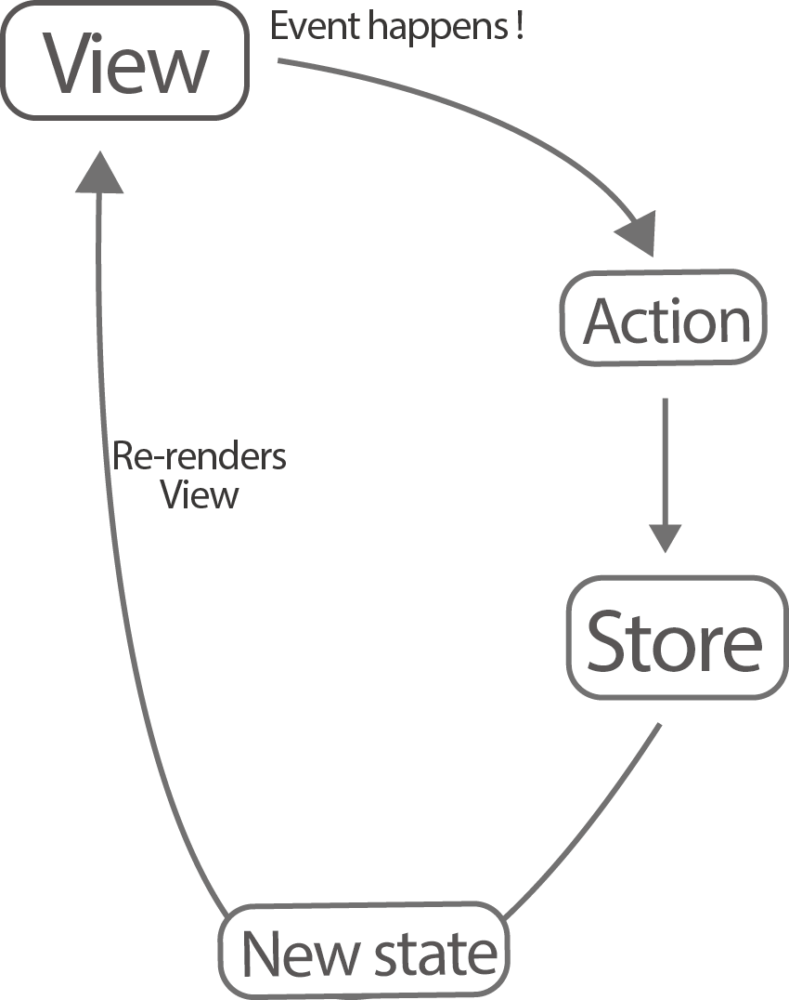
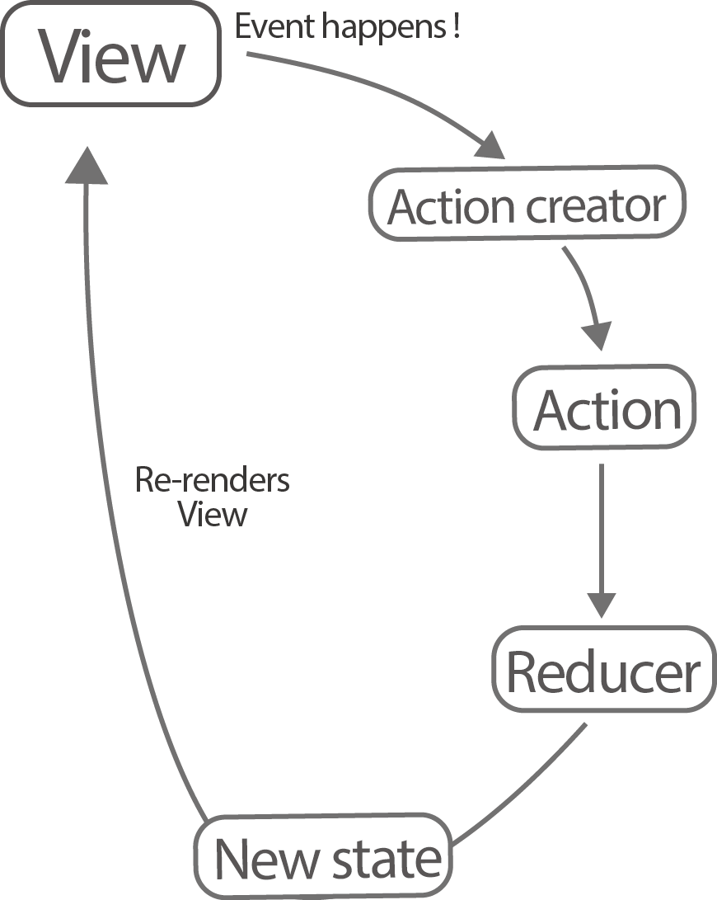

# Redux 아키텍쳐에 관하여 -1편-

React를 조금이라도 배워보신 분에게는 정말 익숙하고 빠질 수 없는 단어가 하나 붙습니다. 바로 Redux 라는 단어 인데요, 도대체 Redux 아키텍쳐가 무엇이길래 React와 항상 함께 따라붙는 것일까요? 그리고 도대체 어떤 부분이 그렇게 좋길래 이 패턴을 많은 사람들이 사용하는 것일까요?  공식 문서를 보면 맨 첫문장에 Redux는 "predictable state container for Javascript" 라고 나와 있습니다. 이 말만 보면 Redux가 무엇인지 도대체 전혀 감이 오지 않습니다. ~~영어를 좀 읽을줄 안다고 자신하던~~ 저도 처음 읽었을 때 도무지 무슨 말인지 이해할 수 없습니다. 하지만 많은 시행착오를 겪고 다른 글들을 읽은 결과 Redux에 대해서 조금 더 깊은 이해를 할 수 있었는데요,  1년정도의 기간동안 사용해본 결과 Redux는 러닝커브가 상당히 있고 오히려 처음에는 이를 통해 설계를 할 때, 구조 자체를 구축하느라 상당한 시간을 잡아먹기도 합니다. 허나 Redux는 정말 가볍고 잘 설계되어 있어 그 사용방법과 lifecycle을 제대로 꽤찰 시에 헤어나오기 힘든 좋은 "MVC대체제" 가 될 것입니다. 함수형 프로그램의 진가를 느끼게 해주는, React의 장점을 최대한으로 끌어올려주는 라이브러리의 매력은 배울만한 가치를 충분히 느끼게 해줍니다.

따라서 저의 첫 포스트는 여러분에게 Redux라는 계륵같지만 알고보면 재미있는 놈에 대해서 소개를 해드리려 합니다. 


### Redux의 탄생 

여러분은 Redux가 사실 지금의 형태와 같은 라이브러리가 되기 위해서 시작된 프로젝트가 아닌 것을 알고 계신가요?  이미 Facebook이 제작한 Flux 라는 나름 괜찮은(사실 아주 괜찮은) 아키텍쳐가 있었고 Redux를 만든이 중 한명으로 가장 유명한 *Dan Abramov*는  라이브러리를 개발 하기 전 "time travel 과 hot reloading"를 React에서 사용하도록 하는 것에 관심을 가지고 있었다고 합니다. 다른 뛰어난 인재들과 함께 그는 기존의 Flux를 기반으로 이것을 하나의 아키텍쳐로 만들어낼 수 있었고 이를 Redux라 이름을 붙였습니다. 

그럼 도대체 Flux 아키텍쳐란 무었이고 Redux와 어떻게 다를까요?
Redux를 이해하기 위해서는 Flux 아키텍쳐가 왜 만들어졌고 어떤식으로 작동하는지에 대해서 알아보는 것이 필수불가결 합니다. 사실 Flux를 잘 이해하면 Redux를 이해하는것은 그다지 어렵지 않습니다. 

### 기존 MVC구조와 Flux 구조에 대한 선이해

OOP와 함께 등장한 것은 바로 MVC구조 인데요, 당시 고안 되었을 시에는 기존보다 훨신 코드를 깔끔하고 명료하게 구분해서 작성할 수 있어서 프로그램 설계의 기본이 되어왔던 구조입니다. 하지만 기존보다 훨씬 복잡하고 거대한 애플리케이션이 나오고 있는 지금, 특히나 SPA의 등장으로 MVC의 고질적인 문제점은 점점 커져만 갔습니다. 그 문제점에 대해 한 번 살펴보겠습니다.

MVC 구조를 보면 양방향으로 데이터를 전송하기 때문에 그 구조가 상당히 복잡해지는 현상을 볼 수 있습니다. 대부분 Controller들이 View의 상태를 변경해야 하고 이는 model에 있는 데이터과 로직을 통해서 하기 때문에 (*사실 로직이 어느 부분으로 넘어가느냐는 설계 방식에 따라 달라질 수 있지만*)  앱이 커질 수록 model 과 view를 연결하는 로직이 상당히 복잡해지고, 페이스북 정도의 대규모 웹사이트 같은 경우는 기능을 하나 추가할 때 마다 엄청난 양의 작업이 필요했으며 예상치 못한 에러와 버그들이 등장했다고 합니다. 페이스북 개발자들에 의하면 *"하나의 기능을 추가할 때마다 그 complexity 는 expotential(지수함수 적으로, 기하 급수적으로)하게 증가를 한다고 합니다."* 이는 예측하기 쉽지 않은 코드를 만들어내며 이러한 점들 때문에 코드에 손 대는 행위 자체를 꺼려진다고 합니다. 

MVC 아키텍쳐에서는 model 과 view가 쌍방향으로 데이터를 주고 받기 때문에 데이터의 관리가 상당히 복잡해집니다. 특히나 유저 이벤트가 굉장히 많은 페이스북의 경우 유저가 하나의 event를 trigger했을 시에 앱의 다른 곳에 다른 state나 기능을 작동시키면서 더더욱 관리가 복잡해지겠지요. 이런식의 개발 방식은 개발자에게 극악입니다. 하나의 이벤트가 어떤식으로 앱에서 동작하는지 전혀 trace할 수 없기 때문이죠. 

이런 이유에서 바로 flux라는 것이 등장을 한 것입니다. Flux 아키텍쳐를 가장 잘 설명하는 단어는 바로 **단반향 데이터 흐름(unidirectional data flow)** 입니다. 

시계가 한 방향으로만 가듯이 Flux 아키텍쳐에서는 모든 event가 원형 형태의 flow를 가지고 있습니다. 여기서 몇 가지 중요한 개념들이 등장합니다. 한 번 살펴볼까요?

**Action**이란 앱 내의 변화를 말합니다. 쉽게 예를 들어 user event나, 자바스크립트에서 자주 있는 timeout, 비동기 서버 요청들 등을 말합니다.

**Dispatcher**는 위의 모든action들을 죄다 받아냅니다. 그리고 아래 설명할 store에게 필요시에 state를 변경하라고 명령합니다

**Store**은 앱내의 모든 **state**의 저장소 입니다. Dispatcher에게 명령을 받아 바꿀 state가 있으면 바꾸도록 하는 역할을 가지고 있습니다. MVC모델에서 model과 꽤 큰 차이점을 보이는 부분이죠. store에는 앱의 로직이 담겨있지 않습니다.

따라서 그림을 하나 그려보자면 다음과 같은 flow가 나오겠네요.


Flux의 이러한 싸이클 구조의 시작은 당연히 action이 발생할 때입니다.  그럼 이 cycle의 시발점은 당연히 action의 발생이겠네요. 결국 Flux구조의 대단함은 여기서 나옵니다. 앱 내의 어떠한 변화가 일어날 때 마다 이러한 cycle이 돌게 되고 이에 따라서 state가 항상 새롭게 refresh 되는 것이죠. 

여기서 또 한 가지 중요한 부분은, 이런식으로 state가 새롭게 업데이트 될 때마다 React는 **매번 모든 Component들을 새롭게 업데이트 한다는 점입니다.** 이를 두고 컴포넌트들을 *re-render* 한다고 합니다. 


### 단방향 데이터 흐름과 View Reload

여기서 잠시 그럼 왜 이런식의 단방향 흐름 패턴이 유용한지 알아보겠습니다.
예를들어 페이스북 사용자 채팅 목록에서 제 친구들의 현재 접속 상태가 다음과 같다고 합시다.

> <활동중>
> 홍길동 online -web 
> 김철수 online -web
> 박영희 online -web 
> <대기>
> 이민수 online -mobile  

다음을 외운 상태에서 여기서 다음과 같은 이벤트들이 일어났다고 가정 합시다. 

눈으로만 쭉 읽어보세요.

홍길동은 오프라인이 되었다 
-> 김철수는 오프라인이 되었다 
-> 이병정은 접속을 했다
-> 김철수는 온라인이 되었다
-> 박영희는 대기 상태이다
-> 박영희는 모바일로 접속했다

이 일련의 이벤트들을 한 번 만 읽고 다시 채팅 목록의 접속 상태를 머릿속에 그릴 수 있나요?
만약 바로 된다면 상당히 좋은? 기억력과 머리를 가지고 계신 것 같습니다. 최소한 저는 못했거든요...
만약에 이벤트들이 새로 일어날 때마다 다음과 같이 기록해놓은 "상태" 를 변환시킨다면 어떨까요?

```javascript
[
	{name:"홍길동", client: "web", idle:false}
	{name:"김철수", client: "web", idle:false}
	{name:"박영희", client: "web", idle:true}
	{name:"이민수", client: "mobile", idle:true}
	{name:"이병정", client: "web", idle:false}
]
```

아마 각각의 상태를 트래킹하기 훨씬 편리하겠죠? 
즉, 이런식으로 state를 event마다 관리 해주면 UI가 어떤식으로 visualize 되어야 하는지를 단 한방에 알 수 있습니다.


Facebook은 마치 이를 두고 *"90년대 처럼 개발한다!"* 라고 발표때 한 적이 있습니다. 

서버사이드 랜더링을 주로 했던 90년대의 경우 브라우저 단에 들어가는 자바스크립트는 거의 없습니다. 

1. Data 변화가 있으면 refresh를 한다 : data 변화가 있으면 React는 각각의 컴포넌트들을 re-render 한다.
2. Flux는 Restful 한 웹 애플리케이션을 만드는 것을 쉽게 만들어준다. : idempotencey(*계속 같은 명령을 시행시켜도 같은 결과값을  나타내주는 것*) 와  referential transparientcy(*참조되고 있는 부분을  같은 의미의 다른 것으로 바꾸어도 아무런 영향을 주지 않는 코드*) 

2번에 대해 조금 더 설명을 해드리자면, 마치 우리가 예전에 항상 같은 url을 입력하면 같은 화면을 서버로 부터 받았던것 처럼 **React도 항상 같은 data값을 입력하면 같은 View를 보여줍니다.** 결국 Restful하게 앱을 설계하는 이유도 모든것을 예측가능하게(predictable) 설계하고 싶은 이유에서인데, react 와 flux architecture를 통해서 이를 할 수 있다는 뜻입니다. 지금은 잘 이해가 안되시는 분들을 위해 idempotencey는 functional programming이라는 주제로 글을 써보도록 하겠습니다. 일단 잘 이해가 안되시면 넘어가시길 바랍니다.

하지만 이런식으로 한개의 상태 변화마다 view를 새롭게 render하는 과정에서 큰 문제점이 생깁니다. Browser내의 DOM은 자체 state를 보유하고 있기 때문에 rendering을 새로 할 때마다 엄청난 퍼포먼스 저하와 함께 너무 느려서 못쓸 정도가 되죠. 예를 들어 React 에서는 유저가 input field에 글자를 하나 입력할때마다, 혹은 스크롤을 내릴 때 마다 새롭게 state를 변화시키도록 설계하는 부분이 있을 수 있습니다. 이런식으로  설계를 해버리면 매 순간 브라우저가 새로운 DOM 노드를 만들고 새로 view를 그리다 쓸수 없을 정도로 느려져 버리고 말겠죠. 

Facebook은 이런 문제를 해결할 방법이 필요했고, 그 해결방법에 대해 잠시만 집고 넘어갑시다.

### Virtual DOM의 등장

DOM의 이러한 문제점 때문에 등장한 것이 바로 virtual DOM(가상 DOM) 입니다.  

- React는 상태 변화가 있을 때마다 실제 DOM을 아예 rebuild 하기 보다는  새로운 **가상 DOM**을 만듭니다. 
- 그 후에 가상 DOM은 이전 DOM과의 차이점을 쉽고 빠르게 찾아냅니다. 
- 차이점을 찾고 나서 React는 DOM을 최소한으로 변경하기 위한 최적의 변경경로를 찾고 이를 실제 DOM 변경 queue에 넣습니다.

하지만 이는 React 내부 단에서 모두 처리를 해줌으로 우리는 전혀 신경쓸 것 없이 그저 최종 UI가 어떤 식으로 이루어져야 할지 만 state를 기반으로 머릿속에 snapshot(스샷?)을 찍어서 생각하면 됩니다.


### Redux의 등장

그럼 다시 Flux와 Redux 얘기로 돌아와 볼까요?
Redux는 Flux와 다르게 오직 data를 보관하는 store(*쉽게 보관소라고 생각하면 됩니다*)가 **한개** 입니다. 이것은 Flux 아키텍쳐와 가장 큰 차이점이며, store에는 user logic이 전혀 없습니다. 즉, Redux는 앱 내의 모든 데이터(state)를 관리하는 공간이라고 쉽게 생각할 수 있습니다.  이벤트가 일어난 후 action은 바로 store로 dispatch(보내지는행위)가 됩니다. 그렇기 때문에 dispatcher가 필요 없게 되죠. 그때 store는 각 action들을 reducer 이란 놈에게 보냅니다. 잠시 요어 정리를 하고 갑시다.

Redux 에서
**Store**(혹은 Redux)는 데이터를 저장하는 단 한개의 큰 저장 공간입니다.
**Action**은 앱 내의 변화를 담고 있는 자바스크립트 **object**입니다. 
**Action Creator**는 실제 유저 이벤트에 따라 Action을 알맞게 생성해주는 자바스크립트 **function** 입니다.
**Reducer**는 state을 바꾸어주는 **function** 이며 store에서 action 을 받아온 후 바꿔야할 state가 있는경우 이를 변경 합니다.(실제로는 새로운 state를 반환하는 것이지만 이는 잠시 후 알아봅시다)

방금 Reducer는  함수라고 했었죠? 이 Reducer는 현재의 state와 action을 파라미터로 받습니다. 마치 다음과 같죠

```Javasc
function someReducer(currentState, action) {
  //lines of code
  return newState
}
```

모든 Reducer들은 action을 받지만, 자신이 변경해야할 action이 포함되어 있지 않은 이상 다시 원래의 state를 내보내게 되어있습니다. 그리고 이 과정이 모두 일어난 뒤에 React는 모든 component들을 refresh시키죠.

즉 이 구조의 흐름도를 대강 파악해보면 다음과 같겠죠?




이를 조금 더 자세히 살펴보면





맨 처음 엑션크리에이터에 의해 엑션이 생성이 되고 이는 리듀서들로 들어가 리듀서는 새로운 스테이트를 내보내어 뷰의 렌더링을 다시 합니다.

여기서 신기한 점은 action이 하나 나올때 마다 **모든** reducer에게 보내진다는 것입니다. 
뭔가 비효율적인것 같은데 왜냐? 
한 가지 action이 여러가지 state를 한꺼번에 바꿔야 할 필요가 있을 때가 있기 때문이죠. 블로그를 예로 들어봅시다. 
사용자가 게시글을 추가함으로써 총 게시글의 개수, 해당 게시판 게시글의 개수, 게시글의 목록 등 여러가지 수치(state)를 한 번에 바꾸어주어야 합니다. 

또한 reducer는 절대로 state를 변경(manipulate)하지 않고 대신에 **새로운 state** 를 보냅니다. 이는 나중에 React와 Redux가 Virtual DOM 단에서 변경사항을 알아보는데 쉽게 하기 위함입니다. 


Redux의 기본 구조를 서명하는데만 상당히 많은 시간이 걸렸네요. 원래는 글 하나에 다 쓸 수 있을 것 같았는데 점점 길어져서 여러편에 나누어 써야겠습니다. 일단 이번 글은 리덕스의 탄생 배경와 그 기본 원리에 대해서 이해를 하셨으면 됩니다. 다음 편에서 보아용!

